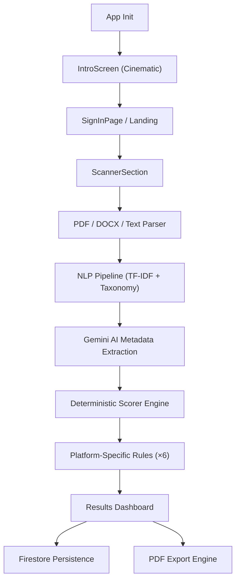

<div align="center">

# ATSify — Beat the Algorithm

<p align="center">
	<a href="https://github.com/Rudra-P9/ATSify/stargazers"></a>
	<a href="https://github.com/Rudra-P9/ATSify/network/members"></a>
	<a href="https://github.com/Rudra-P9/ATSify/issues"></a>
	
	
</p>

<p align="center">
	
	
	
	
	
	
	<a href="https://github.com/Rudra-P9/ATSify/pulls"></a>
</p>

</div>

<p align="center">
	<picture>
		
	</picture>
</p>

<p align="center">
An enterprise-grade ATS simulation engine that reverse-engineers resume scoring logic<br/>from platforms like <strong>Workday</strong>, <strong>Taleo</strong>, <strong>iCIMS</strong>, <strong>Greenhouse</strong>, <strong>Lever</strong>, and <strong>SuccessFactors</strong>.<br/>
Built with React 19, TypeScript, and powered by <strong>Google Gemini 1.5 Flash</strong>.
</p>

<p align="center"><strong><a href="https://at-sify-pied.vercel.app/">🚀 Live Demo</a></strong> · <strong><a href="https://github.com/Rudra-P9/ATSify/issues">Report Bug</a></strong> · <strong><a href="https://github.com/Rudra-P9/ATSify/issues">Request Feature</a></strong></p>

---

<details>
	<summary><b>📑 Table of Contents</b></summary>

- [Overview](#overview)
- [Features](#features)
- [Tech Stack](#tech-stack)
- [Architecture](#architecture)
- [Quick Start](#quick-start)
- [Environment Variables](#environment-variables)
- [Scripts](#scripts)
- [Project Structure](#project-structure)
- [Deployment](#deployment)
- [Contributing](#contributing)
- [Maintainer](#maintainer)
- [License](#license)
- [Contact](#contact)

</details>

## Overview

Traditional resume checkers give you generic advice. **ATSify** gives you deterministic simulation.

It analyzes resume depth, formatting risks, and keyword density against a specific job description, then generates parallel compatibility scores across **6 major enterprise ATS platforms** simultaneously. The AI-driven Intelligence Scanner identifies future-dated entries, quantified achievement gaps, and formatting hazards that prevent recruiters from ever seeing your data.

## Features

- 🎬 **Cinematic Startup** — Multi-phase holographic initialization sequence (Globe → Data Extraction → System Ready)
- 🖥️ **Multi-System Simulation** — Parallel scoring for Workday, Taleo, iCIMS, Greenhouse, Lever, and SuccessFactors
- 🔍 **Deep Skill Parsing** — NLP-powered keyword extraction with TF-IDF scoring and skills taxonomy matching
- 📊 **Priority Focus Areas** — Interactive, expandable analysis of Formatting, Experience Quality, and Section Structure
- 🤖 **AI-Powered Insights** — Gemini 1.5 Flash for nuanced understanding of experience impact beyond keyword matching
- 🔐 **Persistence** — Firebase Auth + Firestore for user accounts and scan history
- 📄 **Export** — PDF report generation via jsPDF + html-to-image for offline review
- 📱 **Responsive** — Optimized for ultra-wide displays (1600px+) and fully responsive down to mobile

## Tech Stack

| Layer | Technology |
|---|---|
| **Frontend** | React 19, TypeScript, Vite 6 |
| **AI Engine** | Google Gemini 1.5 Flash (`@google/genai`) |
| **Auth / DB** | Firebase Auth, Firestore |
| **Styling** | Tailwind CSS v4, Motion (Framer Motion) |
| **NLP** | Custom TF-IDF, tokenizer, skills taxonomy, synonym matching |
| **PDF** | pdfjs-dist (parse), jsPDF + html-to-image (export) |
| **Icons** | Lucide React |
| **Server** | Express (dev proxy + production serve) |
| **Tooling** | tsx, TypeScript, Vitest |
| **Deployment** | GitHub Pages (CI/CD via Actions) |

## Architecture



## Quick Start

**Prerequisites**
- Node.js 20+
- Gemini API Key ([get one here](https://aistudio.google.com/apikey))
- Firebase Project (optional — for auth & persistence)

**Install and run**

```bash
git clone https://github.com/Rudra-P9/ATSify.git
cd ATSify
npm install
npm run dev
```

The dev server starts at `http://localhost:3000` with Vite HMR via the Express proxy.

**Build for production**

```bash
npm run build
npm run preview
```

## Environment Variables

Create a `.env` file in the project root (see `.env.example`):

```dotenv
# Required — Gemini AI
GEMINI_API_KEY=your_gemini_key_here

# Optional — Firebase (for auth & scan history)
VITE_FIREBASE_API_KEY=...
VITE_FIREBASE_AUTH_DOMAIN=...
VITE_FIREBASE_PROJECT_ID=...
```

## Scripts

| Script | Description |
|---|---|
| `npm run dev` | Start Express + Vite dev server on port 3000 |
| `npm run build` | Production build via Vite |
| `npm run preview` | Preview the production build locally |
| `npm run lint` | TypeScript type-checking (`tsc --noEmit`) |
| `npm run test` | Run tests with Vitest |
| `npm run clean` | Remove the `dist` directory |

## Project Structure

```
ATSify/
├── api/
│   └── analyze.ts              # Gemini analysis serverless handler
├── src/
│   ├── components/
│   │   ├── features/
│   │   │   ├── IntroScreen.tsx  # Multi-phase holographic entry
│   │   │   ├── ScannerSection.tsx
│   │   │   ├── JDInput.tsx
│   │   │   ├── ResumeTextInput.tsx
│   │   │   └── SignInPage.tsx
│   │   ├── layout/
│   │   │   ├── Footer.tsx
│   │   │   └── StaticPage.tsx
│   │   └── ui/
│   │       ├── Loading.tsx      # "Reactor Core" scan animation
│   │       ├── PlatformCard.tsx
│   │       ├── PlatformGrid.tsx
│   │       └── ScoreHeader.tsx
│   ├── lib/
│   │   ├── gemini/             # Prompts & metadata extraction
│   │   ├── nlp/                # TF-IDF, tokenizer, skills taxonomy
│   │   ├── parser/             # PDF, DOCX, section & contact extraction
│   │   ├── pipeline/           # Main analyzeResume orchestrator
│   │   ├── platforms/          # Workday, Taleo, iCIMS, Greenhouse, Lever, SAP
│   │   ├── report/             # Report generation & thresholds
│   │   ├── scorer/             # Keyword, format, experience, education, section scoring
│   │   └── utils.ts
│   ├── store/                  # State management (analysis, resume, scores, JD library)
│   ├── App.tsx
│   ├── main.tsx
│   └── index.css               # Tailwind v4 + custom animations
├── server.ts                   # Express dev server with Vite middleware
├── firestore.rules             # Security rules
├── firebase-blueprint.json     # Data structure reference
├── .github/workflows/
│   └── deploy.yml              # GitHub Pages CI/CD
├── vite.config.ts
├── tsconfig.json
└── package.json
```

## Deployment

The app deploys automatically to **GitHub Pages** on every push to `main` via the included [GitHub Actions workflow](.github/workflows/deploy.yml).

The workflow runs `npm ci` → `npm run build` → uploads the `dist/` artifact → deploys to Pages. The `GEMINI_API_KEY` is injected from repository secrets at build time.

For self-hosted or alternative deployments, the Express server in `server.ts` serves the built assets in production mode and can be deployed to any Node.js hosting provider.

## Contributing

1. Fork the repository
2. Create your feature branch (`git checkout -b feature/amazing-feature`)
3. Commit your changes (`git commit -m 'feat: add amazing feature'`)
4. Push to the branch (`git push origin feature/amazing-feature`)
5. Open a Pull Request

## Maintainer

<table>
	<tr>
		<td width="80">
			
		</td>
		<td>
			<b>Rudra Patel</b><br/>
			Computer Science — University of South Carolina<br/>
			<a href="https://rudrap9.vercel.app/">Portfolio</a> •
			<a href="https://www.linkedin.com/in/rudrap9/">LinkedIn</a> •
			<a href="https://github.com/Rudra-P9">GitHub</a> •
			<a href="mailto:rudra.patel70@yahoo.com">Email</a>
		</td>
	</tr>
	<tr>
		<td colspan="2">
			⭐ If ATSify helped you land an interview, consider starring the repo!
		</td>
	</tr>
</table>

## License

Distributed under the MIT License. See `LICENSE` for more information.

## Contact

- **Email:** [rudra.patel70@yahoo.com](mailto:rudra.patel70@yahoo.com)
- **LinkedIn:** [linkedin.com/in/rudrap9](https://www.linkedin.com/in/rudrap9/)
- **Portfolio:** [rudrap9.vercel.app](https://rudrap9.vercel.app/)
- **Instagram:** [@rudra_p9](https://www.instagram.com/rudra_p9/)
- **Buy Me a Coffee:** [buymeacoffee.com/rudrap9](https://buymeacoffee.com/rudrap9)
