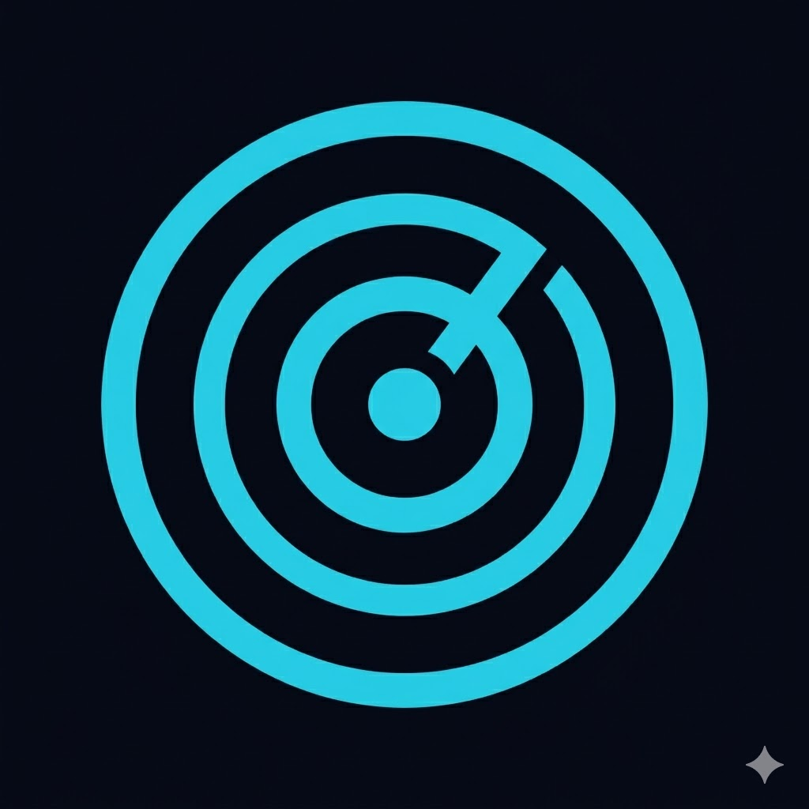
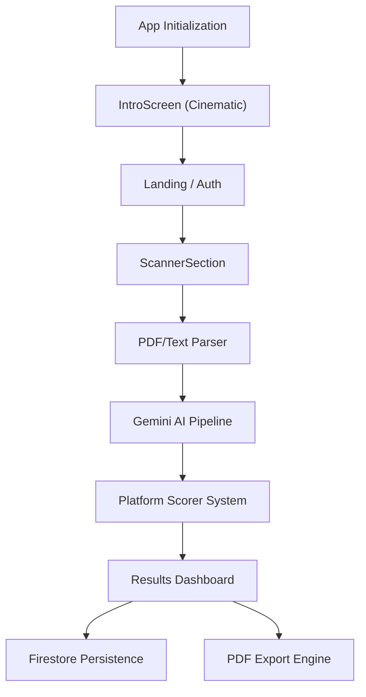

<div align="center">

# ATSify Intelligence — Beat the Algorithm

<p align="center">
	<a href="https://github.com/Rudra-P9/ATSify/stargazers"></a>
	<a href="https://github.com/Rudra-P9/ATSify/network/members"></a>
	<a href="#tech-stack"></a>
	<a href="LICENSE"></a>
	<a href="https://ais-pre-xh2hzvdb4m432ksnz22ire-428353312043.us-east1.run.app"></a>
</p>

<p align="center">
	<a href="https://github.com/Rudra-P9/ATSify/issues"></a>
	<a href="https://github.com/Rudra-P9/ATSify/pulls"></a>
	
	
	
	<a href="#contributing"></a>
</p>

</div>

<p align="center">
	<picture>
		
	</picture>
</p>

**ATSify Intelligence** is an immersive, high-fidelity resume analysis engine designed to simulate enterprise Applicant Tracking Systems (ATS). Built with React 18, TypeScript, and powered by Google Gemini 1.5 Flash, it reverse-engineers the scoring logic of platforms like Workday, Taleo, and Greenhouse to give job seekers an unfair advantage.

<p align="center"><strong><a href="https://atsify-scanner.vercel.app/">Live Demo → Initializing System...</a></strong></p>

<details>
	<summary><b>Table of Contents</b></summary>

- [Overview](#overview)
- [Features](#features)
- [Tech Stack](#tech-stack)
- [Architecture](#architecture)
- [Quick Start](#quick-start)
- [Environment Variables](#environment-variables)
- [Scripts](#scripts)
- [Project Structure](#project-structure)
- [Deployment](#deployment)
- [Contributing](#contributing)
- [FAQ](#faq)
- [Maintainer](#maintainer)
- [License](#license)
- [Contact](#contact)

</details>

## Overview

Traditional resume checkers provide generic advice. **ATSify Intelligence** provides deterministic simulation. By analyzing resume depth, formatting risks, and keyword density against specific job descriptions, the engine generates parallel scores for 6 major enterprise ATS platforms simultaneously. It utilizes AI-driven "Intelligence Scanning" to identify future-dated entries, quantified achievement gaps, and formatting "poison" that stops recruiters from seeing your data.

## Features

- **Cinematic Startup**: A multi-phase holographic initialization sequence (Globe -> Data Extraction -> System Ready).
- **Multi-System Simulation**: Parallel scoring for Workday, Taleo, iCIMS, Greenhouse, Lever, and SuccessFactors.
- **Deep Skill Parsing**: Sophisticated keyword extraction with color-coded "Matched" vs "Missing" visual feedback.
- **Priority Focus Areas**: Interactive, expandable analysis of Formatting, Experience Quality, and Section Structure.
- **AI-Powered Insights**: Powered by Gemini 1.5 Flash for nuanced understanding of experience impact beyond simple keyword matching.
- **Persistence**: Firebase-backed user authentication and scan history tracking.
- **Export Capabilities**: High-fidelity PDF report generation for offline review.
- **Ultra-Wide Responsive**: Optimized for large displays (up to 1600px) and fully responsive for mobile candidates.

## Tech Stack

| Layer | Technology |
|---|---|
| Frontend | React 18, TypeScript, Vite |
| AI Engine | Google Gemini 1.5 Flash SDK |
| Backend/DB | Firebase Auth, Firestore |
| Styling | Tailwind CSS v4, Motion (Framer) |
| Icons | Lucide React |
| Tooling | tsx, ESLint, PDF-lib |
| Deployment | Cloud Run / Google Hosting |

## Architecture



## Quick Start

**Prerequisites**
- Node.js 20+
- Firebase Project
- Gemini API Key

**Install and run**

```bash
npm install
npm run dev
```

**Build and preview**

```bash
npm run build
npm run preview
```

## Environment Variables

The application requires a Gemini API key and Firebase configuration. Define these in your environment:

```dotenv
# Gemini AI
GEMINI_API_KEY=your_gemini_key_here

# Firebase (Client Side)
VITE_FIREBASE_API_KEY=...
VITE_FIREBASE_AUTH_DOMAIN=...
VITE_FIREBASE_PROJECT_ID=...
```

## Scripts

| Script | Action |
|---|---|
| `npm run dev` | Start Vite dev server on port 3000 |
| `npm run build` | Build production-ready assets |
| `npm run preview` | Run local preview of production build |
| `npm run lint` | Run TypeScript type-checking |

## Project Structure

```
ATSify/
├─ src/
│  ├─ components/
│  │  ├─ IntroScreen.tsx      # Multi-phase holographic entry
│  │  ├─ Loading.tsx          # "Reactor Core" animation for scanning
│  │  ├─ ScannerSection.tsx    # Resume/JD upload logic
│  │  └─ ScoreHeader.tsx       # Results visualization
│  ├─ lib/
│  │  ├─ gemini.ts           # AI Analysis pipeline
│  │  ├─ parser/             # PDF/Docx extraction
│  │  └─ platforms/          # ATS logic definitions
│  ├─ App.tsx                # Main state & route management
│  └─ index.css              # Tailwind + Custom Animations
├─ firestore.rules           # Hardened security policies
└─ firebase-blueprint.json   # Data structure IR
```

## Deployment

The app is optimized for Cloud Run or any static hosting service that supports environment variables. Firebase security rules are managed via `firestore.rules` and should be deployed alongside database changes.

## Contributing

1. Fork the repository
2. Create your feature branch (`git checkout -b feature/AmazingFeature`)
3. Commit your changes (`git commit -m 'Add some AmazingFeature'`)
4. Push to the branch (`git commit -m 'feat: add amazing feature'`)
5. Open a Pull Request

## Maintainer

<table>
	<tr>
		<td width="80">
			
		</td>
		<td>
			<b>Rudra Patel</b><br/>
			Computer Science — University of South Carolina<br/>
			<a href="mailto:Rudra.patel70@yahoo.com">Email</a> •
			<a href="https://www.linkedin.com/in/rudrap9/">LinkedIn</a> •
			<a href="https://github.com/Rudra-P9">GitHub</a>
		</td>
	</tr>
	<tr>
		<td colspan="2">
			⭐ If ATSify helped you land an interview, consider starring the repo!
		</td>
	</tr>
</table>

## License

Distributed under the MIT License. See `LICENSE` for more information.

## Contact

- **Email:** Rudra.patel70@yahoo.com
- **LinkedIn:** [linkedin.com/in/rudrap9/](https://www.linkedin.com/in/rudrap9/)
- **Instagram:** [@rudra_p9](https://www.instagram.com/rudra_p9/)
